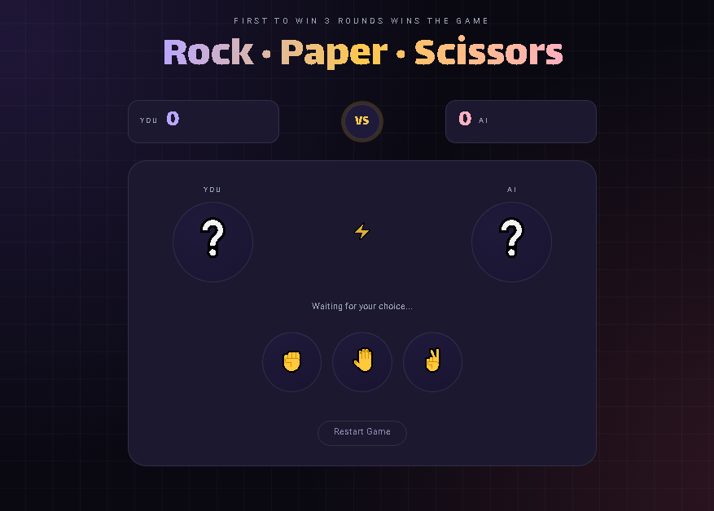

<div align="center">

# ✊🤚✌️ RockPaperDuel

### A Rock Paper Scissors game against an AI opponent, with polished visuals and sound


<br>

### 🎮 [View Live Demo](https://arshiya7-dev.github.io/RockPaperDuel/)

<a href="https://arshiya7-dev.github.io/RockPaperDuel/">
  
</a>

</div>

## ✦ Preview

<p align="center">
  
</p>

---

<br>

## 📖 About The Project

**RockPaperDuel** is a classic Rock Paper Scissors game that runs entirely in the browser against a randomized AI opponent. With every move, your avatar and the AI's avatar light up with a pulse animation, the round's outcome is revealed instantly, and the scoreboard updates in real time. Whoever — you or the AI — reaches **3 wins** first takes the whole match, triggering a win or lose overlay card complete with its own visual effect and sound. 🏆

## ✨ Features

- ✊🤚✌️ **Clean, modern UI** with a purple/pink theme and a subtle dotted grid background
- 🎯 **Randomized AI opponent** that picks a move each round
- 💫 **Pulse animation** on the winning avatar for extra feedback each round
- 🔊 **Sound effects** for clicks, wins, and losses
- 🃏 **Win/lose overlay cards** with a glassmorphism effect at the end of the match
- 🔁 **Restart button** to reset the game at any time
- 🎨 **Custom typography** using Vazirmatn and the display font Lalezar
- 📱 **Fully responsive** for both mobile and desktop
- ♿ Respects `prefers-reduced-motion` to disable animations when needed

## 🛠️ Built With

| Technology | Purpose |
|---|---|
| HTML5 | Page structure |
| Tailwind CSS v4 | Styling via `@theme` and custom utility classes |
| Vanilla JavaScript | Game logic, score tracking, and sound playback |
| Google Fonts | Vazirmatn and Lalezar typefaces |

## 🚀 Running Locally

```bash
# Clone the repository
git clone https://github.com/arshiya7-dev/RockPaperDuel.git

# Move into the project folder
cd RockPaperDuel

# Open index.html in your browser
```

If you want to rebuild the compiled CSS yourself (e.g. after editing `main.css`), run:

```bash
npx @tailwindcss/cli -i ./asset/stylesheet/main.css -o ./asset/stylesheet/output.css --watch
```

## 📁 Project Structure

```
RockPaperDuel/
├── index.html
├── asset/
│   ├── stylesheet/
│   │   ├── main.css       # Main Tailwind source file
│   │   └── output.css     # Compiled CSS output
│   ├── javascript/
│   │   └── script.js      # Game logic
│   └── sounds/             # Click, win, and lose sound effects
└── README.md
```

## 🎯 How To Play

1. Pick one of three moves: **Rock ✊**, **Paper 🤚**, or **Scissors ✌️**
2. The AI simultaneously picks its own move at random
3. The round's result (win, lose, or draw) is shown instantly and the score updates
4. Whoever reaches 3 wins first takes the match 🏆
5. Hit **Restart Game**, or click the result overlay card, to play again

---

<div align="center">

Made with ❤️ by **[Arshiya](https://github.com/arshiya7-dev)**

⭐ Star this repo if you found it helpful!

</div>
